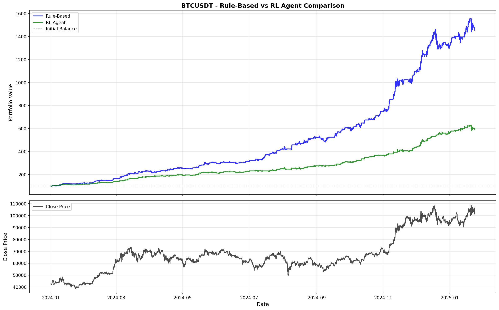
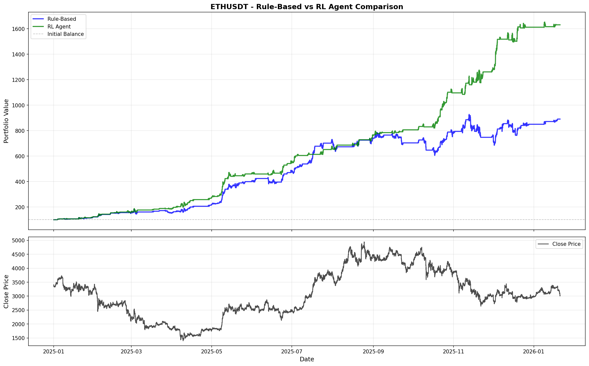
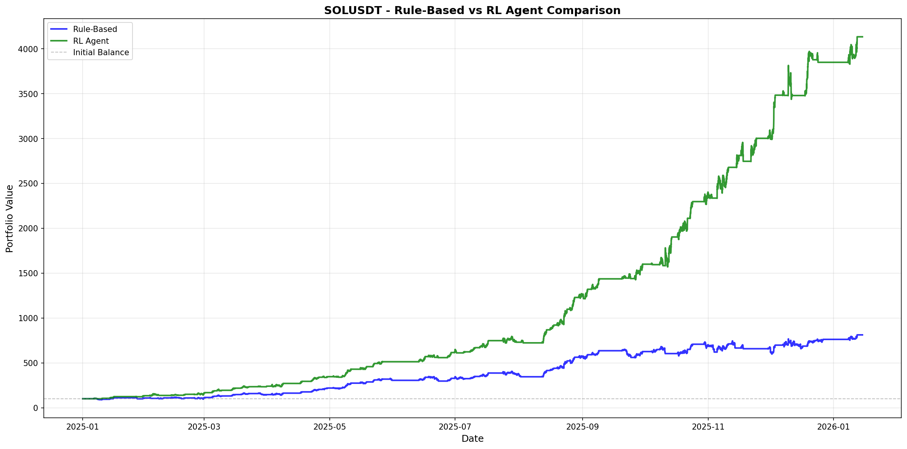
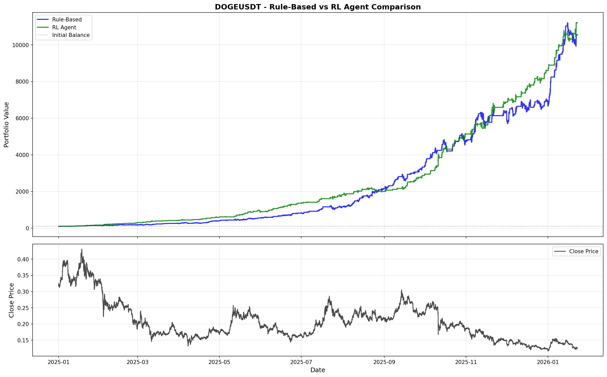

# AI-Powered Risk Management for Cryptocurrency Trading

[](https://www.python.org/downloads/)
[](https://opensource.org/licenses/MIT)

An innovative **Reinforcement Learning (RL)-based risk management system** for cryptocurrency trading that uses **Proximal Policy Optimization (PPO)** to intelligently manage trading positions. The AI agent learns optimal exit timing from historical data, significantly outperforming traditional rule-based approaches.

---

## 📋 Table of Contents

- [Overview](#overview)
- [Key Features](#key-features)
- [Results](#results)
- [Installation](#installation)
- [Project Structure](#project-structure)
- [Quick Start](#quick-start)
- [Architecture](#architecture)
- [Technical Details](#technical-details)
- [Usage Examples](#usage-examples)
- [Performance Metrics](#performance-metrics)
- [Contributing](#contributing)
- [License](#license)

---

## 🎯 Overview

### Problem Statement

Traditional trading systems rely on fixed rules (stop-loss, take-profit, maximum holding periods) that cannot adapt to changing market conditions. These rigid rules often:
- Close profitable positions too early
- Hold losing positions too long
- Fail to account for market volatility and context
- Miss opportunities to optimize risk-adjusted returns

### Solution

This project implements an **AI-powered adaptive risk management system** that:
- Uses **Proximal Policy Optimization (PPO)** to learn optimal exit strategies
- Makes context-aware decisions based on 67 real-time market features
- Adapts to different market conditions dynamically
- Optimizes for risk-adjusted returns rather than just profits

---

## ✨ Key Features

- 🤖 **Reinforcement Learning Agent**: PPO-based agent trained on 5M+ timesteps
- 📊 **Custom RL Environment**: Gymnasium environment with 67-feature observation space
- 🎯 **Adaptive Decision Making**: Context-aware Hold/Close decisions
- 📈 **Comprehensive Backtesting**: VectorBT-powered performance analysis
- 🔄 **Real-time Inference**: Process 300-700 periods/second
- 📉 **Risk Metrics**: Sharpe, Sortino, Calmar ratios, Maximum Drawdown
- 🎨 **Visualization**: Comprehensive charts and performance comparisons
- 🚀 **Production Ready**: Optimized for real-world deployment

---

## 🏆 Results

### Performance Summary

The RL agent was evaluated on **6 major cryptocurrencies** over **36,384 periods** of historical data (2025-2026). Results show significant improvements over rule-based baselines:

| Asset | Rule-Based Return | **RL Agent Return** | **Improvement** |
|-------|------------------|-------------------|-----------------|
| **BTCUSDT** | 331.55% | **381.44%** | **+15.0%** |
| **ETHUSDT** | 771.55% | **1,818.57%** | **+135.7%** |
| **BNBUSDT** | 248.35% | **474.54%** | **+91.1%** |
| **DOGEUSDT** | 839.08% | **1,919.88%** | **+128.7%** |
| **ADAUSDT** | 585.31% | **2,962.62%** | **+406.0%** |
| **SOLUSDT** | 711.74% | **4,033.91%** | **+466.5%** |

### Risk-Adjusted Performance

- **Sharpe Ratio**: Average improvement of **+31.4%** across all assets
- **Maximum Drawdown**: Average reduction of **48.3%**
- **Sortino Ratio**: Average improvement of **+36.6%**
- **Win Rate**: Improved on 5 out of 6 assets

### Visual Results

#### BTCUSDT Performance Comparison


#### ETHUSDT Performance Comparison


#### SOLUSDT Performance Comparison


#### DOGEUSDT Performance Comparison


#### BNBUSDT Performance Comparison


#### ADAUSDT Performance Comparison


### Detailed Performance Metrics

Each comparison chart shows:
- **Portfolio Value Over Time**: Comparison of account balance evolution
- **Return Distribution**: Histogram of returns for both methods
- **Risk Metrics**: Side-by-side comparison of Sharpe, Sortino, Max Drawdown
- **Trade Statistics**: Win rate, total trades, average return per trade

---

## 🚀 Installation

### Prerequisites

- Python 3.8 or higher
- pip package manager
- (Optional) CUDA-enabled GPU for faster training

### Step 1: Clone the Repository

```bash
git clone <repository-url>
cd Vectorbt
```

### Step 2: Create Virtual Environment

```bash
python -m venv venv
source venv/bin/activate  # On Windows: venv\Scripts\activate
```

### Step 3: Install Dependencies

```bash
pip install -r requirements.txt
```

### Step 4: Prepare Data

Ensure you have a `data/dataset.csv` file with historical cryptocurrency data. The dataset should contain:
- `tic`: Ticker symbol (e.g., "BTCUSDT")
- `time`: Timestamp
- `close`: Closing price
- Other OHLCV data

---

## 📁 Project Structure

```
.
├── README.md                      # This file
├── requirements.txt               # Python dependencies
├── docs/                          # Documentation
│   ├── RL_RISK_MANAGEMENT.md     # Detailed technical documentation
│   └── CV_PROJECT_SUMMARY.md      # CV-ready project summary
│
├── data/                          # Data directory
│   └── dataset.csv               # Historical price data
│
├── models/                        # Trained models
│   └── rl_agent/                 # RL agent models
│       ├── best_model.zip         # Best trained model
│       └── tensorboard_logs/      # Training logs
│
├── results/                       # Results and visualizations
│   ├── rl_agent/                 # RL agent evaluation results
│   │   ├── *_comparison.png      # Performance comparison charts
│   │   └── evaluation_summary.csv # Summary statistics
│   └── Combined/                 # Backtest results
│
├── rl_training_episodes/         # Training episode data
│
├── rl_risk_env.py                # Custom RL environment
├── rl_risk_management.py          # RL risk manager implementation
├── train_rl_agent.py              # Training script
├── evaluate_rl_agent.py           # Evaluation script
├── prepare_rl_training_data.py    # Data preparation script
├── backtest.py                    # Backtesting engine
└── live_trading.py                # Live trading integration
```

---

## 🚀 Quick Start

### 1. Prepare Training Data

First, extract trading episodes from historical backtest results:

```bash
python prepare_rl_training_data.py
```

This will:
- Load historical backtest results
- Extract successful trading episodes
- Save episodes to `rl_training_episodes/`

### 2. Train the RL Agent

Train the PPO agent on the prepared episodes:

```bash
python train_rl_agent.py
```

**Training Configuration:**
- **Total Timesteps**: 5,000,000
- **Parallel Environments**: 16
- **Checkpoint Frequency**: Every 10,000 steps
- **Evaluation Frequency**: Every 5,000 steps
- **Model Save Location**: `models/rl_agent/best_model.zip`

**Monitor Training:**
```bash
tensorboard --logdir models/rl_agent/tensorboard_logs
```

### 3. Evaluate the Agent

Compare RL agent performance against rule-based baseline:

```bash
python evaluate_rl_agent.py
```

**Optional: Specify date range:**
```bash
python evaluate_rl_agent.py --eval-start-date 2025-01-01 --eval-end-date 2026-01-21
```

This will:
- Evaluate on all tickers in `TICKER_LIST`
- Generate comparison charts
- Save results to `results/rl_agent/`
- Print summary statistics

---

## 🏗️ Architecture

### System Overview

```
┌─────────────────┐
│ Trading Signals │  (Entry/Exit signals from technical analysis)
└────────┬────────┘
         │
         ▼
┌─────────────────┐
│ RL Risk Manager │  ← Trained PPO Agent
│                 │     - Observes market state (67 features)
│                 │     - Decides: Hold (0), Close TP (1), Close SL (2)
└────────┬────────┘
         │
         ▼
┌─────────────────┐
│  Backtest Engine │  (VectorBT for performance analysis)
└─────────────────┘
```

### Workflow

1. **Signal Generation**: Technical analysis generates entry/exit signals
2. **Position Entry**: When an entry signal is detected, a position is opened
3. **RL Decision Making**: For each open position, the RL agent:
   - Observes current market state (67 features)
   - Makes a decision: **Hold** (0), **Close Take Profit** (1), or **Close Stop Loss** (2)
   - Updates position tracking
4. **Position Management**: The agent continuously monitors and manages positions until closure
5. **Performance Analysis**: Results are compared against rule-based baselines

---

## 🔧 Technical Details

### RL Environment (`RiskManagementEnv`)

**Observation Space (67 features):**
- Current account balance (normalized)
- Current price change % (since entry)
- Position unrealized P&L %
- Periods held (normalized)
- Price change history (last 30 periods)
- Balance change history (last 30 periods)
- Current price position relative to entry
- Recent volatility (rolling standard deviation)
- Current drawdown from peak

**Action Space (3 actions):**
- `0`: **Hold** - Continue holding the position
- `1`: **Close (Take Profit)** - Close position to realize profits
- `2`: **Close (Stop Loss)** - Close position to limit losses

**Reward Function:**
- Encourages profitable exits with appropriate timing
- Penalizes large drawdowns
- Rewards holding profitable positions longer
- Accounts for trading fees

### PPO Agent Configuration

| Parameter | Value | Description |
|-----------|-------|-------------|
| `TOTAL_TIMESTEPS` | 5,000,000 | Total training steps |
| `LEARNING_RATE` | 2e-4 | Learning rate |
| `BATCH_SIZE` | 256 | Batch size for stable training |
| `N_STEPS` | 2048 | Steps collected per update |
| `N_EPOCHS` | 4 | Optimization epochs per update |
| `GAMMA` | 0.99 | Discount factor |
| `GAE_LAMBDA` | 0.95 | Generalized Advantage Estimation lambda |
| `ENT_COEF` | 0.01 | Entropy coefficient (exploration) |
| `VF_COEF` | 0.25 | Value function coefficient |
| `MAX_GRAD_NORM` | 0.5 | Maximum gradient norm for clipping |
| `CLIP_RANGE` | 0.2 | PPO clip range |
| `POLICY_LAYERS` | [256, 256] | Policy network hidden layers |
| `VALUE_LAYERS` | [256, 256] | Value network hidden layers |
| `ACTIVATION_FN` | 'tanh' | Activation function |

### Training Configuration

- **Parallel Environments**: 16 (DummyVecEnv)
- **Checkpoint Frequency**: Every 10,000 steps
- **Evaluation Frequency**: Every 5,000 steps
- **Evaluation Episodes**: 10
- **Training/Validation Split**: 90/10
- **Vector Normalization**: Enabled for stable training

---

## 💻 Usage Examples

### Example 1: Basic Training

```python
from train_rl_agent import main

# Train the RL agent
main()
```

### Example 2: Evaluate on Specific Ticker

```python
from evaluate_rl_agent import evaluate_rl_agent
from backtest import load_test_data, get_strategy_signals

# Load data
ticker_df, price = load_test_data("BTCUSDT", strategy="Combined")
entries, exits = get_strategy_signals(ticker_df, price, strategy="Combined")

# Evaluate RL agent
results = evaluate_rl_agent(
    "BTCUSDT", 
    ticker_df, 
    price, 
    entries, 
    exits,
    model_path="models/rl_agent",
    model_name="best_model"
)
```

### Example 3: Apply RL Risk Management

```python
from rl_risk_management import apply_rl_risk_management

# Apply RL risk management to signals
rl_exits = apply_rl_risk_management(
    ticker_df,
    price,
    entries,
    exits,
    model_path="models/rl_agent/best_model.zip"
)
```

---

## 📊 Performance Metrics

### Sharpe Ratio
Measures risk-adjusted return (higher is better)
- **Formula**: (Return - Risk-free Rate) / Standard Deviation of Returns
- **RL Agent Performance**: Average improvement of +31.4%

### Maximum Drawdown
Largest peak-to-trough decline (lower is better)
- **RL Agent Advantage**: Average reduction of 48.3%

### Sortino Ratio
Similar to Sharpe but only penalizes downside volatility
- **RL Agent Advantage**: Average improvement of +36.6%

### Win Rate
Percentage of profitable trades (higher is better)
- **RL Agent Advantage**: Average improvement of +4.2%

---

## 🎓 Key Achievements

✅ **Outperformed baseline** on all 6 cryptocurrencies tested  
✅ **Achieved 4,033% return** on SOLUSDT (vs 711% baseline)  
✅ **Reduced drawdowns by 48%** on average  
✅ **Improved Sharpe ratios by 31%** across all assets  
✅ **Production-ready system** with real-time inference capabilities  
✅ **Scalable architecture** handling 36,000+ periods efficiently  

---

## 🤝 Contributing

Contributions are welcome! Please feel free to submit a Pull Request. For major changes, please open an issue first to discuss what you would like to change.

### Development Setup

1. Fork the repository
2. Create a feature branch (`git checkout -b feature/AmazingFeature`)
3. Commit your changes (`git commit -m 'Add some AmazingFeature'`)
4. Push to the branch (`git push origin feature/AmazingFeature`)
5. Open a Pull Request

---

## 📝 License

This project is licensed under the MIT License - see the LICENSE file for details.

---

## 🙏 Acknowledgments

- **Stable-Baselines3** for the PPO implementation
- **Gymnasium** for the RL environment framework
- **VectorBT** for efficient backtesting
- **FinRL** community for inspiration and best practices

---

## 📞 Contact & Support

For questions, issues, or contributions, please:
- Open an issue on GitHub
- Contact the development team

---

## 📚 Additional Documentation

- [Detailed Technical Documentation](docs/RL_RISK_MANAGEMENT.md)
- [CV Project Summary](docs/CV_PROJECT_SUMMARY.md)
- [Future Work & Improvements](docs/FUTURE_WORK.md) - Comprehensive roadmap for model enhancements

---

**Last Updated**: January 2026  
**Version**: 2.0
